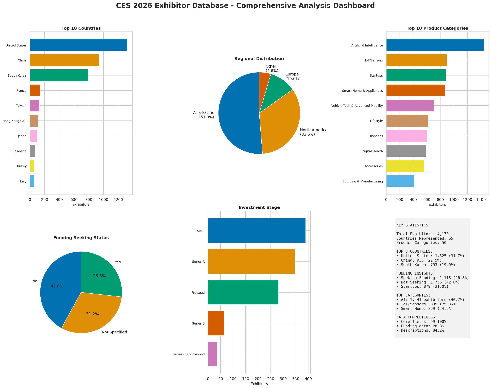

# CES 2026 Exhibitor Database

Comprehensive exhibitor information from CES 2026 (Consumer Electronics Show) including company details, booth locations, product categories, and funding information.

## Access the Database

**[View CES 2026 Exhibitor Database on Google Sheets](https://docs.google.com/spreadsheets/d/1p2KgnD3UI4qH8G3q0rD_hbdEfq480B-j/edit?usp=sharing&ouid=104753634455432639165&rtpof=true&sd=true)**

Download options available in the `output/` directory:
- **JSON**: `CES 2026 Exhibitor Database (Enriched with Funding & Revenue Data).json`
- **CSV**: `CES 2026 Exhibitor Database (Enriched with Funding & Revenue Data).csv`

---

## Dataset Overview

| Metric | Value |
|--------|-------|
| **Total Exhibitors** | 4,178 companies |
| **Countries/Regions Represented** | 65 |
| **Product Categories** | 50 unique categories |
| **Avg Categories per Exhibitor** | 4.1 |

---

## Key Insights



### Geographic Distribution

**Top 5 Countries/Regions:**

| Country | Exhibitors | Share |
|---------|------------|-------|
| United States | 1,325 | 31.7% |
| China | 938 | 22.5% |
| South Korea | 793 | 19.0% |
| France | 137 | 3.3% |
| Taiwan | 131 | 3.1% |

**Regional Breakdown:**
- **Asia-Pacific**: 51.3% (2,142 exhibitors)
- **North America**: 33.6% (1,402 exhibitors)
- **Europe**: 10.6% (442 exhibitors)
- **Other regions**: 4.6% (192 exhibitors)

### Top Product Categories

| Category | Exhibitors | Share |
|----------|------------|-------|
| Artificial Intelligence | 1,441 | 40.7% |
| IoT/Sensors | 895 | 25.3% |
| Startups | 879 | 24.8% |
| Smart Home & Appliances | 869 | 24.6% |
| Vehicle Tech & Advanced Mobility | 704 | 19.9% |
| Lifestyle | 622 | 17.6% |
| Robotics | 605 | 17.1% |
| Digital Health | 584 | 16.5% |
| Accessories | 560 | 15.8% |
| Sourcing & Manufacturing | 415 | 11.7% |

### Funding & Investment Analysis

**Funding Seeking Status:**
| Status | Exhibitors | Share |
|--------|------------|-------|
| Not seeking | 1,756 | 42.0% |
| Not specified | 1,303 | 31.2% |
| Seeking funding | 1,118 | 26.8% |

**Investment Stage Distribution (of those seeking):**
| Stage | Exhibitors | Share |
|-------|------------|-------|
| Seed | 389 | 34.8% |
| Series A | 348 | 31.1% |
| Pre-seed | 281 | 25.1% |
| Series B | 65 | 5.8% |
| Series C+ | 35 | 3.1% |

**Funding Amounts Sought:**
| Range | Exhibitors | Share |
|-------|------------|-------|
| $250K - $2M | 430 | 38.5% |
| $2M - $15M | 415 | 37.1% |
| < $250K | 124 | 11.1% |
| $15M - $50M | 101 | 9.0% |
| > $50M | 47 | 4.2% |

### Startup Insights

- **879 startups** (21% of all exhibitors)
- **60.1%** of startups are actively seeking funding

**Top Startup Countries:**
| Country | Startups |
|---------|----------|
| South Korea | 251 |
| United States | 246 |
| France | 63 |

**Funding Seeking Rate by Country:**
| Country | Seeking Funding |
|---------|-----------------|
| Turkey | 63.3% |
| France | 61.3% |
| Italy | 61.0% |
| South Korea | 37.2% |
| United States | 20.8% |
| China | 11.0% |

### Venue Distribution

| Venue | Exhibitors |
|-------|------------|
| Venetian Expo, Hall G | 857 |
| Venetian Expo, Halls A-D | 647 |
| LVCC, South Hall 2 | 371 |
| LVCC, North Hall | 346 |
| LVCC, Central Hall | 249 |

---

## Key Takeaways

1. **AI dominates** - Over 40% of exhibitors are in the AI space, reflecting the industry's current focus

2. **Asia-Pacific leads** - More than half of exhibitors come from Asia-Pacific, with strong representation from China and South Korea

3. **Active startup ecosystem** - 879 startups with 60% actively seeking funding, primarily at Seed/Series A stages

4. **European companies more funding-hungry** - France, Turkey, and Italy have the highest rates of companies seeking funding (60%+)

5. **Diverse technology landscape** - 50 product categories spanning AI, IoT, mobility, health, and entertainment

---

## Database Fields

| Field | Description |
|-------|-------------|
| `name` | Company/exhibitor name |
| `exhid` | Unique exhibitor ID |
| `detail_url` | Link to exhibitor detail page |
| `booth_venue` | Venue location (LVCC, Venetian, etc.) |
| `booth_number` | Booth number |
| `booth_full` | Complete booth location string |
| `description` | Company description |
| `website` | Company website URL |
| `address` | Full company address |
| `product_categories` | Product categories (semicolon-separated) |
| `hall_ids` | Hall location IDs |
| `seek_funding` | Whether seeking investment |
| `funding_amount` | Funding amount sought |
| `revenue` | Company revenue range |
| `investment_stage` | Current investment stage |
| `country` | Company headquarters country |

## Data Quality

| Completeness Level | Fields |
|--------------------|--------|
| High (>95%) | Name, ID, URL, Booth Number, Website, Address, Country, Hall IDs |
| Moderate (68-88%) | Booth Venue, Description, Product Categories, Seek Funding |
| Lower (~27%) | Funding Amount, Revenue, Investment Stage (only for funding-seeking companies) |

---

## Use Cases

### For Investors
- Filter by `seek_funding = Yes` to find 1,118 investment opportunities
- Match `investment_stage` to your fund's focus (Seed, Series A, etc.)
- Use `funding_amount` to find deals in your target range
- Assess company maturity via `revenue` field

### For Business Development
- Search `product_categories` to find companies in your target market
- Use `booth_venue` and `booth_number` to plan CES meetings
- Filter by `country` for international partnership opportunities

### For Market Research
- Analyze distribution across 50 product categories
- Study geographic representation across 65 countries
- Track funding landscape and investment trends
- Understand technology sector breakdowns

---

## Data Collection Tool

This repository also includes the Rust-based scraper used to collect the data.

### Prerequisites

- Rust 1.70+ (install via [rustup](https://rustup.rs/))

### Running the Scraper

```bash
git clone https://github.com/aezizhu/ces_2026_rust_scraper.git
cd ces_2026_rust_scraper
cargo run --release
```

### Technical Details

- **Fast API-based scraping**: Uses the official CES exhibitor API
- **Concurrent requests**: 30 simultaneous connections for speed
- **Dual output formats**: JSON and CSV exports
- **Deduplication**: Automatic removal of duplicates

---

## License

This project is licensed under the **Apache License 2.0** - see the [LICENSE](LICENSE) file for details.

### Attribution Requirements

**If you use this data or software, you MUST provide attribution to the original author.**

```
CES 2026 Exhibitor Database by aezizhu
Licensed under the Apache License 2.0
https://github.com/aezizhu/ces_2026_rust_scraper
```

## Legal Disclaimer

This data is provided for educational and research purposes only. Users are responsible for ensuring compliance with applicable data protection regulations.

## Contributing

Contributions are welcome! Please open an issue or submit a pull request.

## Acknowledgments

- CES (Consumer Electronics Show) for providing the exhibitor platform
